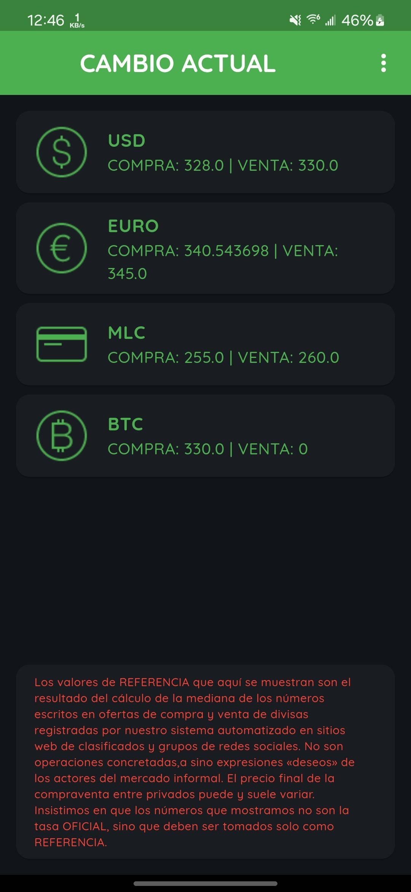
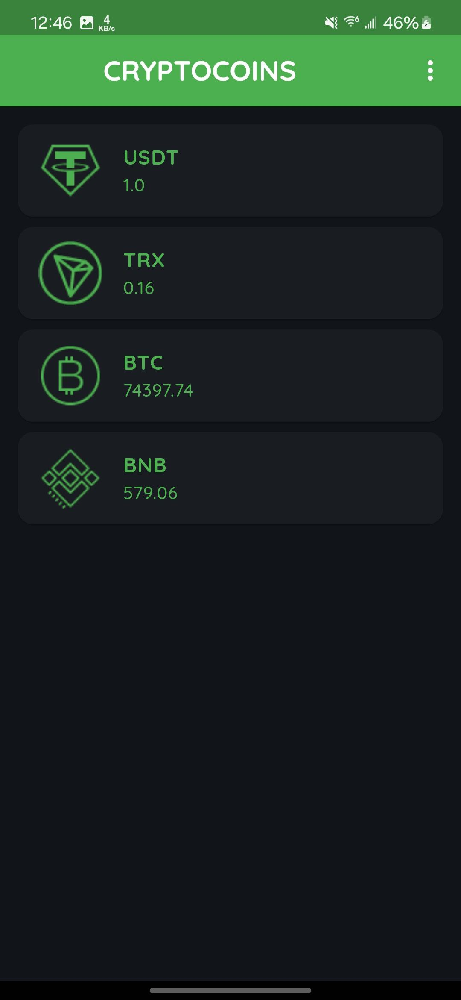
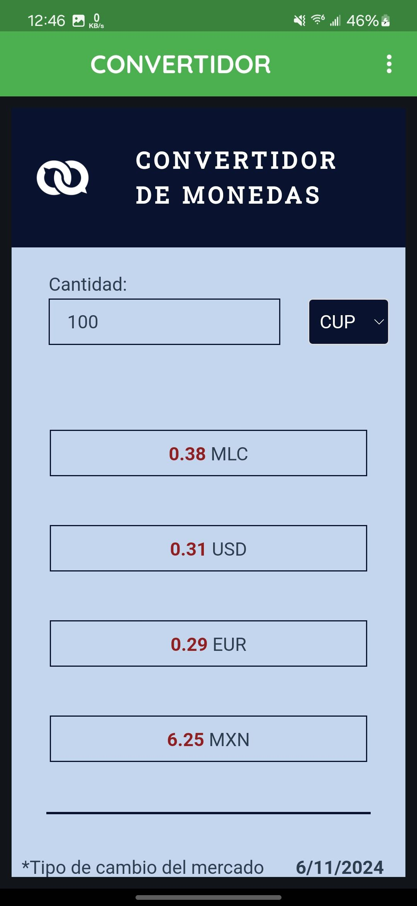
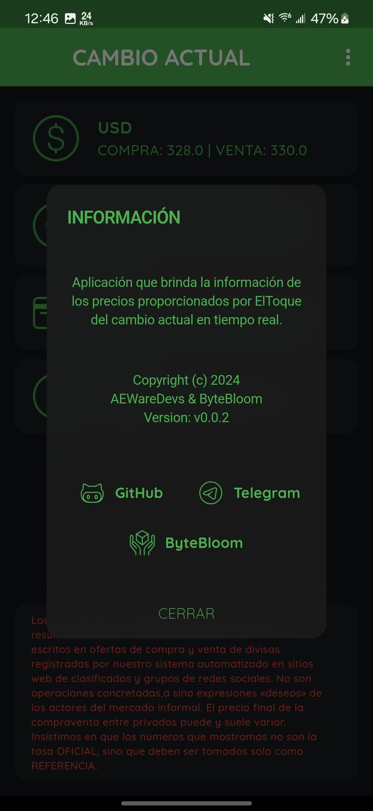

# Cambio Actual

A real-time currency exchange rate and cryptocurrency price viewer built with Flet. This application provides up-to-date information on various currency exchange rates and cryptocurrency prices using data from ElToque.

## Download
<div align="center">
    <a href="https://github.com/ElJoker63/cambio-actual/releases/download/v0.0.3/Cambio.Actual_0.0.3_202411121-windows-amd64.zip"></a><a href="https://github.com/ElJoker63/cambio-actual/releases/download/v0.0.3/app-release.apk"></a><br>

</div>

## Features

- Real-time currency exchange rates
- Cryptocurrency price tracking
- Dark mode interface
- Responsive design
- Easy navigation between views
- Reference information display

## Prerequisites

- Python 3.7 or higher
- Flet library
- Internet connection for API access

## Installation

1. Clone the repository:

```
git clone https://github.com/ElJoker63/cambio-actual
```

2. Install the required dependencies:

```
pip install -r requirements.txt
```

3. Make sure you have the following assets in your project structure:
4. `/assets/fonts/` - Contains Quicksand font family files
5. `/assets/` - Contains currency and cryptocurrency icons

## Running the Application

To run the application, navigate to the project directory and execute:

```
flet run
```

The application will start in dark mode by default and display the main currency exchange view.

## Project Structure

- `main.py` - Main application file containing the UI and logic
- `api_toque.py` - API integration for fetching exchange rates and crypto prices
- `/assets/` - Directory containing images and fonts
- `/assets/fonts/` - Quicksand font family files
- Currency and cryptocurrency icons (PNG format)

## Usage

- The main view displays currency exchange rates for USD, ECU, MLC, and BTC
- Click the currency exchange icon in the top bar to switch to cryptocurrency view
- Click the home icon to return to the main view
- Click the information icon to view app details and links

## Version

Current version: 0.0.3

## License

Free

## Links

- GitHub: [https://github.com/ElJoker63/cambio-actual](https://github.com/ElJoker63/cambio-actual)
- Telegram: [@ElJoker63](https://t.me/ElJoker63)

## Disclaimer

The exchange rates shown in this application are reference values calculated from informal market data. They are not official rates and should be taken only as a reference. The final price of private buying and selling may vary.
