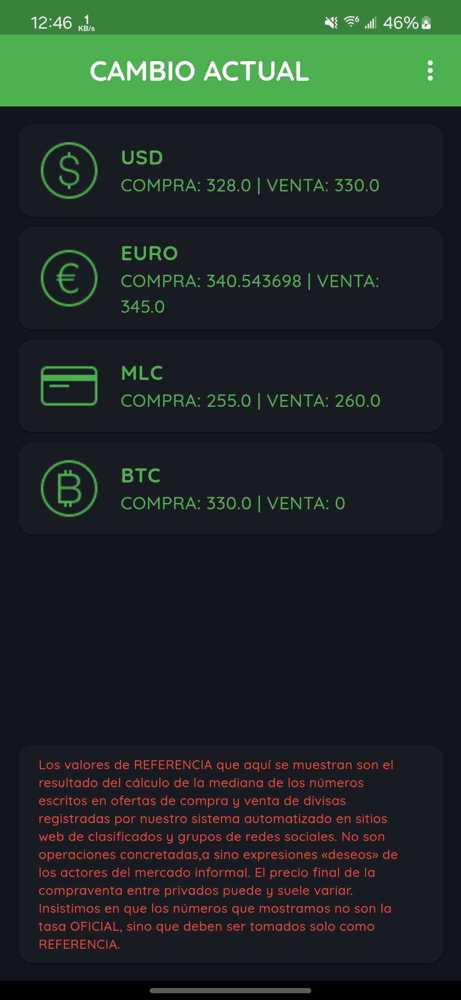
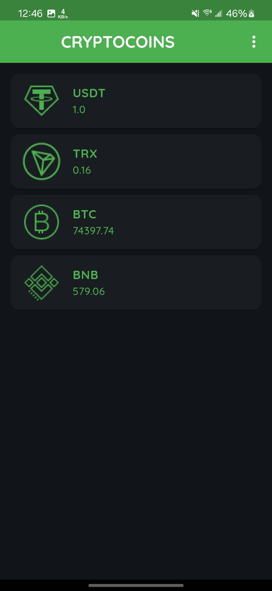
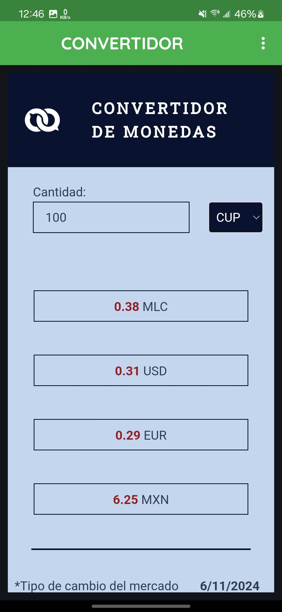
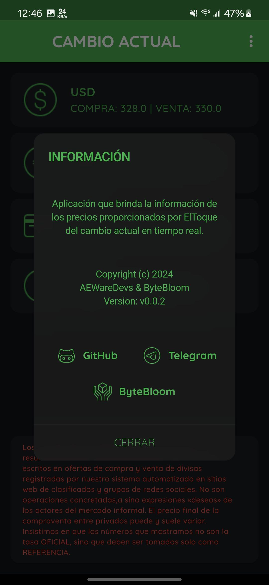

# Cambio Actual

Un visualizador de tipos de cambio de divisas y precios de criptomonedas en tiempo real creado con Flet. Esta aplicación proporciona información actualizada sobre diversos tipos de cambio de divisas y precios de criptomonedas utilizando datos de ElToque.

## Descarga
<div align="center">
    <a href="https://github.com/ElJoker63/cambio-actual/blob/main/app/Cambio Actual_0.0.2_202411062-windows-amd64.zip"></a><a href="https://github.com/ElJoker63/cambio-actual/releases/download/v0.0.2/app-release.apk"></a><br>

</div>

## Características

- Tasas de cambio de divisas en tiempo real
- Seguimiento de precios de criptomonedas
- Interfaz en modo oscuro
- Diseño responsivo
- Navegación sencilla entre vistas
- Visualización de información de referencia

## Requisitos previos

- Python 3.7 o superior
- Biblioteca Flet
- Conexión a Internet para acceso a la API

## Instalación

1. Clona el repositorio:

```plaintext
git clone https://github.com/ElJoker63/cambio-actual
```

2. Instala las dependencias necesarias:

```plaintext
pip install flet
```

3. Asegúrate de tener los siguientes activos en la estructura de tu proyecto:
4. `/assets/fonts/` - Contiene archivos de la familia de fuentes Quicksand
5. `/assets/` - Contiene íconos de monedas y criptomonedas

## Ejecutar la aplicación

Para ejecutar la aplicación, navega al directorio del proyecto y ejecuta:

```plaintext
flet run
```

La aplicación se iniciará en modo oscuro predeterminado y muestra la vista principal de cambio de moneda.

## Estructura del proyecto

- `main.py` - Archivo principal de la aplicación que contiene la interfaz de usuario y la lógica
- `api_toque.py` - Integración de API para obtener tipos de cambio y precios de criptomonedas
- `/assets/` - Directorio que contiene imágenes y fuentes
- `/assets/fonts/` - Archivos de la familia de fuentes Quicksand
- Íconos de moneda y criptomoneda (formato PNG)

## Uso

- La vista principal muestra los tipos de cambio de moneda para USD, ECU, MLC y BTC
- Haga clic en el ícono de cambio de moneda en la barra superior para cambiar a la vista de criptomoneda
- Haga clic en el ícono de inicio para volver a la vista principal
- Haga clic en el ícono de información para ver los detalles y enlaces de la aplicación

## Versión

Versión actual: 0.0.2

## Licencia

Free

## Enlaces

- GitHub: [https://github.com/ElJoker63/cambio-actual](https://github.com/ElJoker63/cambio-actual)
- Telegram: [@ElJoker63](https://t.me/ElJoker63)

## Aviso legal

Los tipos de cambio que se muestran en esta aplicación son valores de referencia calculados a partir de datos del mercado informal. No son tipos oficiales y deben tomarse solo como referencia. El precio final de compra y venta privada puede variar.
